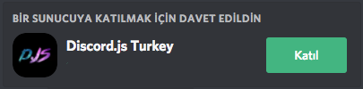

# Giriş

## Giriş

Bu rehbere başlama kararı almamın nedeni, internet üzerinde yetirince ayrıntılı bir bilgi bulunmaması. Burada bahsedilen içeriklerin bazıları, örnekleri klasikleşmiş olduğu için başka yerlerden de alıntılanmıştır. Botların nasıl çalıştığını ve mantığını anlatmak için adım adım ilerleyeceğim bu rehbere sonunda başlama kararı aldım. Başta böylesine bir dökümantasyon için yeterli bilgim olmadığından ve yeni başlayan birine biraz ürkütücü durduğundan, epey bir süre ertelemek zorunda kalmıştım. İnsanlar tarafından her gün tekrarlanan sorular netleştikçe not aldım ve sonunda bu sorulara ilişkin çözümleri örnekleriyle açıklama fırsatı buldum.

Resmi bir dökümantasyon elde edebilmem için bazı terimleri sabitleştiriyorum. Bu yüzden `client` ve `message` olarak adlandırıyor olacağım. Bazı kişilerin botlarında bu değerler `bot` ve `msg` olarak geçiyor olabilir.

Bunun dışında şimdiye kadar alışılmış bir yabancı dil kalıbı mevcut olduğundan ve bot yazan insanlar bu dile alıştığından, dökümantasyon içerisinde bu dile dokunmadan ve türkçeleştirmeden olduğu gibi bırakacağım. Ayrıca bu terimlerin ne olduğunu merak edenler için ilerleyen zamanlarda `kullanılan terimler` adında bir sayfa oluşturacağım ve türkçe karşılığının ne olduğu, ne işe yaradığı gibi bilgilere oradan erişebiliyor olacaksınız.

## Bize Destek Olun

Dökümantasyon ile ilgili soru ve görüşlerinizi, isteklerinizi discord sunucusu üzerinden iletebilir ve bana ulaşabilirsiniz. İstek ve önerilerinizi dinlemekten mutluluk duyacağım.

## Dökümantasyon Güncellemesi

Burada yazılan içeriği çevrimiçi olarak gün geçtikçe düzenlemek istiyorum. Ancak bazı durumlarda buranın güncellemesi geçikiyor olabilir. Bu yüzden sizlerle burada bunları ne zaman yaptığımla alakalı bazı bilgiler paylaşıyor olacağım.

Dökümantasyonu oluştururken kullanılacak olan;

Node.js Versiyonu: `10.9.0`

Discord.js Versiyonu: `12.0.0-dev`

Son Dökümantasyon Güncellemesi: `22/08/2018`

