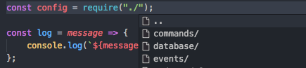
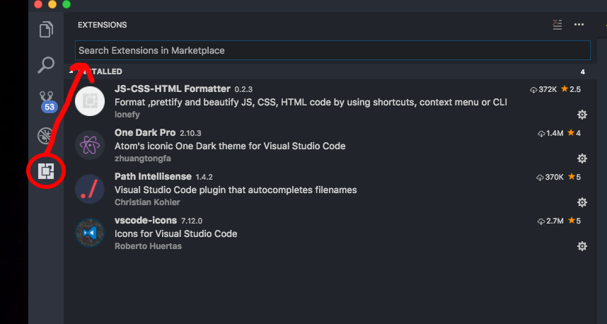

# Bir Editör Yüklemek ve Kullanmak

## Bir Editör Yüklemek ve Kullanmak

Günümüzde bir çok editör mevcut. Her birinin birbirinden farklı ve yapılacak işe göre cazip yönleri var. SublimeText, Atom, Buckets, Visual Studio Code...

Ben size bu projeyi yaparken kullandığım Visual Studio Code'un yüklenmesini ve bazı eklentilerinin nasıl kurulacağını anlatıyor olacağım. Diğer seçenekleri kullanmak istiyorsanız internetteki kurulumlarına göz atmanız gerekecek. Alışık olduğunuz düzeni bozmamanız ve yabancısı olduğunuz editörleri en azından bu projeyi sürdürürken kullanmamanızı tavsiye ederim. Bir çoğunun çalışma mantığı aynı olsa da, bazı yerlerde farklılıklar gösterebiliyor ve bu da kullanan kişi için zorluklar doğrabiliyor.

## Visual Studio Code Yüklemesi

Birkaç adımda bunun nasıl olacağını size anlatayım:

1. [Visual Studio Code](https://code.visualstudio.com) sayfasına gidin.
2. Sağ üst köşedeki **Download** butonuna tıklayın.
3. İndirme işlemi sona erdiğinde, inen dosyayı çalıştırarak kurulumu tamamlayın.

Visual Studio Code çalışmaya başlayacaktır. Eğer yükleme ekranından sonra çalışmıyorsa, çift tıklayarak siz başlatabilirsiniz.

## Projenizi Açmak

Aslında bu işlemi yapmak çok kolay. Bot dosyalarınızın içinde olduğu klasörü sürükleyip, Visual Studio Code'un içine bırakmak işinizi halledecektir. Ama çok daha karmaşık bir yöntem istiyorsanız şu adımları takip edebilirsiniz;

1. Dosya &gt; Aç diyerek klasörünüzün konumunu bulun.
2. Klasörü seçtikten sonra **Aç** butonuna tıklayın.

Sol tarafta klasörünüz gözükecektir. Endişelenmeyin dosyalarınız hiçbir yere gitmedi. Sonrasında ana bot dosyanızın olduğu dizine giderek \(app.js, bot.js veya adı artık neyse\) çift tıklayın.

Ve gördüğünüz gibi artık kodlarınız çok daha derli ve renkli gözüküyor. Gözlerinizi yormaması adına koyu temalar seçmeyi tercih etmeyi unutmayın.

## Eklentiler ve Yükleme İşlemleri

Eklentiler kodlamanıza yardımcı olan şeylerdir. Visual Studio Code'da bir çok eklenti mevcut. Bunların adı Extansions olarak da geçer.

### Kullanmış Olduğum Extension'lar

* JS-CSS-HTML Formatter \(0.2.3\)
* One Dark Pro \(2.10.3\)
* Path Intellisense \(1.4.2\)
* vscode-icons \(7.12.0\)

#### 1. JS-CSS-HTML Formatter

Bu ekleyntiyi kurmamın nedeni tek tek okunurluklarını elle düzeltmekten üşendiğim için. CTRL+S yaptığınızda eğer bu eklenti varsa, dosyalarınızı kodlarınızı otomatik olarak düzenliyor ve o şekide kaydediyor. Aynı zamanda bunu başka projelerinizde de kullanabilirsiniz.

#### 2. One Dark Pro

Tamamen göz yormaması adına kullandığım bir eklenti. Uzun süreler boyunca ekrana bakıp kod yazıyorsanız gerçekten işinize yarayabilir sizin de. Renklendirmeleri ve görünümü diğer baktıklarımın arasında en iyisiydi.

#### 3. Path Intellisense

Bu eklenti özellikle bir dosya require edecekseniz çok işinize yarayabilir.

#### 4. vscode-icons

Klasörlerin içindeki dosyaların formatına göre iconlar koyarak o dosyanın ne olduğunu daha rahat tespit edebilmenizi sağlıyor. Aynı isimde farklı bir uzantıya sahip dosyaların tespit edilmesini kolaylaştırıyor.

### Nasıl Yüklenir?

1. Visual Studio Code açıkken pencerenin sol kenar çubuğında en altta yer alan kare simgeye tıklayın.
2. Hemen sağında bir sütun açılacak, yukarıdaki arama simgesinin olduğu çubuğa tıklayarak yüklemek istediğiniz eklentiyi adıyla aratın.
3. Bulduktan sonra da "install" ya da "yükle" diyerek işleminizi tamamlayabilirsiniz.

> **Not:** Bazı eklentilerin çalışması için Visual Studio Code programını yeniden başlatmanız gerekebilir.

