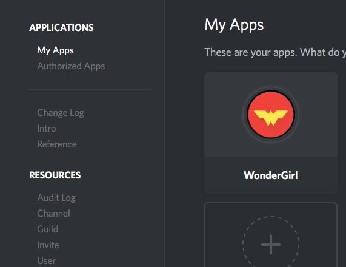
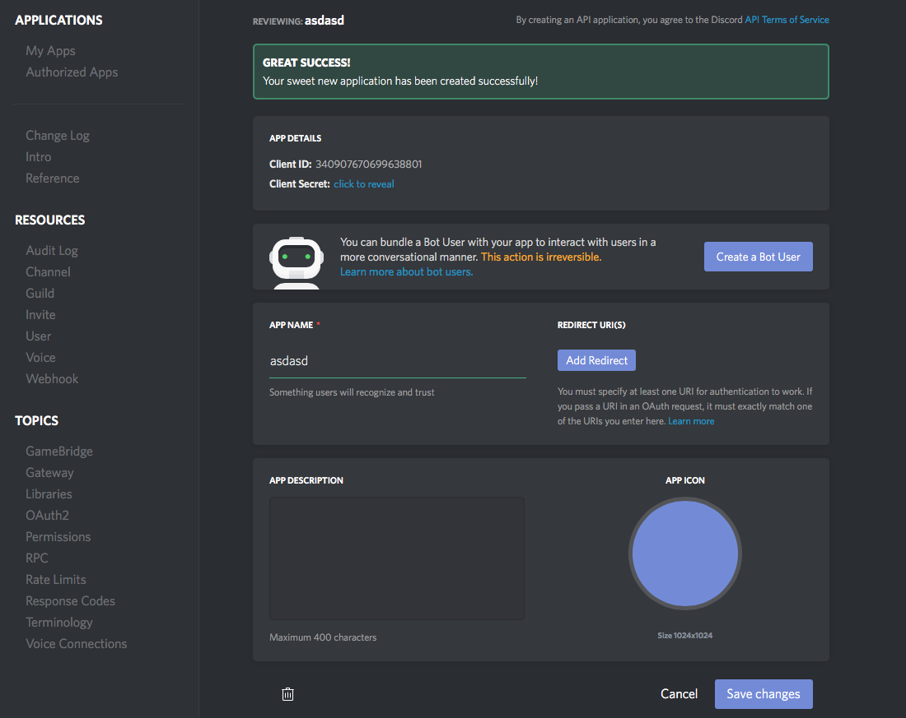
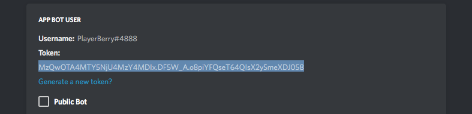

# Bot Yapımına Başlamak - Uzun Anlatım

## Bot Yapımına Başlamak

Bir bot yazmaya başlamadan önce biraz JavaScript ve belki de biraz Node.js biliyor olmanızda fayda var. Örneğin bir müzik botu yapmak gibi harika bir fikriniz var yada çok güzel bir komut fikriniz...

> Bu kısım **uzun bir anlatım** içermektedir. İçerisinde belirli şakalar ve bir bebeğe anlatır gibi açıklamalar mevcut olacaktır. Kısa versiyonlarına bakmak isterseniz: Windows, Linux sayfalarına bakabilirsiniz.

Bu bölüm size botu oluşturmak, ayarlamak ve birkaç basit komut eklemek gibi temel bir klavuz olacaktır.

## 1. Bir Uygulama Oluşturmak ve Bot Hesabı Açmak

Bir bot yazabilmenin ilk adımı, kendi Discord uygulamanızı yaratmaktır. Bot, kimlik doğrulama amacıyla Discord API'sini kullanmak için bir **token** \(Anahtar\) isteyecektir. Merak etmeyin, bu işlem birkaç basit adımdan ibaret.

### Uygulama Oluşturmak

Bir uygulama oluşturabilmeniz için, discordapp.com sayfasındaki [Application](https://discordapp.com/developers/applications/me) kısmına gitmeniz gerekiyor. Eğer bu siteye giriş yapmamışsanız şimdi yapabilirsiniz. Giriş yaptıktan sonra karşınıza çıkan sayfa şuna benzeyecek:

Bu sayfaya geldiğinizde **New Application** butonuna tıklayın. Karşınıza iki yeni bölüm çıkacak bunlardan birisi App ID \(Bunu ileriki işlemler için bir yere not edebilirsiniz. notepad vs.\) Diğeri de **Create a Bot User** kısmı. Tam olarak aradığınız şey de bu! Derhal bu butona tıklayarak "**Yes, Do it.**" butonuna tıklayın.

### Botunuzu Sunucunuza Davet Etmek

Evet bunu yapmak için henüz erken olabilir. Botunuz için tek bir satır kod yazmamış bile olsanız bunun bir önemli yok. Bir botu sunucuya eklemek için o sunucuyu yönetme yetkinizin olması gerekiyor. Eğer yoksa davet etme linkleri ya da başka yöntemler ne yazık ki işe yaramamakta.

Bu işlemi otomatik olarak yaptırmak için kısa bir yok. API referansı bağlantıda gömülü, bu yüzden size bu konuda yardımcı olmaya çalışacağım. Aşağıdaki linkte yer alan Client\_ID yazan yeri, botunuzun öncesinde kaydetmesini istediğim kısmıyla değiştirmeniz gerekiyor.

[https://discordapp.com/oauth2/authorize?client\_id=Client\_ID&scope=bot](https://discordapp.com/oauth2/authorize?client_id=Client_ID&scope=bot)

> Karşınıza çıkan ekranda yapmak istediğiniz bota göre izinler atayabilirsiniz.

Bu işlemden sonra botu eklemek için sunucuyu seçmenizi isteyen bir sayfayla karşılaşacaksınız. Eklemek istediğiniz sunucuyu seçerek **Authorize** butonuna tıklayın.

### Botunuz İçin Token \(Anahtar\) Almak

> Bu kısma çok **DİKKAT ETMELİSİNİZ.** Bundan sonraki bölüm gerçekten çok önemli. Botunuzun token'ı **GİZLİ OLMAK ZORUNDADIR.** Bu token'ı Discord'a giriş yaparken kullanmış olduğunuz kullanıcı adı ve şifresi gibi düşünün. Bu botunuzun sunucunuza girmesi için gerekli bir şifredir. Bunu ifşa etmeniz demek internete kişisel olarak kullandığınız şifrenizi paylaşmanız gibi bir şeydir. Bu token'a sahip olan herkes, sunucunuzdaki mesajları silmek, kullanıcılarınızı banlamak gibi bir çok tehlikeli işlemi yapabilir. Bunlara pastebin, hastebin gibi internet sitelerine kodlarınızı koymak, herkese açık bir şekilde GitHub'ta kodlarınızı paylaşmak ya da ekran görüntüsü alıp atmak da dahildir. Lütfen bu kısmı anladığınızdan **EMİN OLUN.**

Bu önemli uyarıdan sonra kaldığımız yerden devam edebiliriz. Bu token, botu doğrulamak için gerekli olan bir anahtardır. Bunun için click to reveal butonuna tıklarayarak token'ınızı görebilirsiniz. Sonrasında şöyle bir şeye benzeyecektir:

> Tam olarak buna ihtiyacınız var. Lütfen buradaki token'ı koypalarken **Client Secret'ı koplayalamamış olduğunuza** emin olun. Oradaki kısım botlar için kullanılmıyor. Sadece yukarıdaki resimdeki gibi token yazan yerin altındaki kısım.

## 2. Kodlamaya Hazır Hale Gelmek

Bunu söyleyeceğimi hiç düşünmezdim ancak sadece notepad'e copy-paste ederek botunuzun çalışmasını bekleyemezsiniz. Discord.js'yi kullanabilmek için bilgisayarınıza birkaç şey yüklemeniz gerekiyor.

* Node.js için 8.2.1 sürümünü edinin \(Discord.js 7.6 yada daha alt versiyonlarında dersteklenmez.\) Windows için [buradan](https://nodejs.org/en/download/current/), Linux kullanıyorsaniz da [buradan](https://nodejs.org/en/download/package-manager/) yönergeleri takip ederek indirebilirsiniz.
* Asla notepad ya da notepad ++ kullanmayın. Gerçekten berbat. Şiddetle [VS Code](https://code.visualstudio.com), [SublimeText 3](https://www.sublimetext.com/3) yada [Atom](https://atom.io) öneriyorum.

Gerekli yazılımları edindikten sonra yapmanız gerek ilk adım çalışmanız için kendinize bir yer açmaktır. Düzenli çalışabilmeniz için dosyalarınızı masaüstüne koymayın. Bu gerçekten çok sağlıksız. Birden fazla sabit sürücünüz ya da disk bölümünüz varsa, geliştirme projeleriniz için buralarda özel bir yer oluşturabilirsiniz. `D:\devBot` gibi. Bir klasör oluşturduktan sonra CLI \(Komut satırı arabirimi\)'ni burada çalıştırmanız gerekiyor. Linux kullanıcıları bunun nasıl olacağınız zaten biliyorlardır. Windows kullanıcıları içinse küçük bir ipucu: Klasörün içinde SHIFT + Sağ-Tık yaparak "Komut penceresini burada aç" yazısına basın.

Artık bir sonraki adıma geçmek için hazırsınız!

## Discord.js Yüklemek

Evet CLI hazır olduğuna göre artık Discord.js'yi yüklemeye koyulabiliriz. Bunun yapmanız gereken birkaç basit kopyala-yapıştır işlemi yapmanız. Bunun için NPM \(Node Package Manager\)'i kullanıyor olacağız.

* `npm init -y` yazarak **package.json** adındaki yeni dosyamızı oluşturmuş olduk. Bunun hakkında daha detaylı bilgi için [tıklayın](https://docs.npmjs.com/files/package.json).
* Ardından `npm i -S discord.js` yazarak indirme işleminin bitmesini bekleyin.

Bu işlem sırasında ekrandan yazılar akmaya başlayacaktır. Lütfen endişe etmeyin. Her şeyin yolunda gittiğine dair bir işarettir bu. Mevcut klasörünüzde `node_modules` adında bir klasör oluştuğunu göreceksiniz. Bu discord.js için gerekli olan dosyaların yüklendiğine işarettir. Emin olmak isterseniz klasörün içine girerek discord.js adında bir klasör var mı yok mu diye kontrol edebilirsiniz.

Eğer her şey yolundaysa, [İlk Botunuz](i-lk-botunuz.md) için hazırsınız.

## Yardımcı Olabilecek Kaynaklar

* [Discord.js Dökümantasyonu](https://discord.js.org/#/docs/main/stable/general/welcome)
* [Resmi Discord.js Sunucusu](https://discord.gg/bRCvFy9)
* CodeBerry

